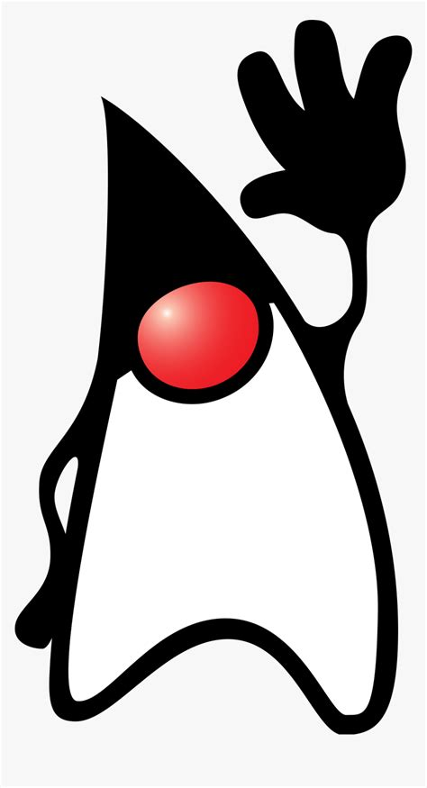

Java je objektno-orijentirani programski jezik nastao 1995. godine i predstavlja globalni standard za razvoj klasičnih, ugradbenih i mobilnih aplikacija, igara, Web i poslovnih aplikacija. Vrlo je raširen i spada u sam vrh na ljestvici upotrebe programskih jezika. Priča o Javi započinje 1990. godine u poduzeću Sun Microsystems gdje su si za cilj postavili integraciju potrošačke elektronike i računala što je u ono vrijeme bio izrazito napredan cilj i ispred svog vremena. Zbog frustracija postojećim programskim jezicima poput C/C++ osnovali su jedan tim - The Green Team, koji će raditi na projektu s ciljem stvaranja novog, prenosivog i efikasnog programskog jezika za navedenu upotrebu. Na čelu toga tima je bio James Gosling. Tim je razvio jezik pod imenom Oak kojim se moglo programirati različite vrste uređaja.

S obzirom da projekt nije uspio zbog činjenice da je bio ispred svog vremena, zeleni tim je dobio novi zadatak da pronađe neku drugu upotrebu za svoj jezik. Budući da je sredina devedesetih godina prošlog stoljeća vrijeme proboja Interneta i World Wide Web-a, tim se fokusirao na multimediju na Web-u i unaprjeđenje Web stranica. Našli su novu primjenu Oaka za izradu apleta koji predstavljaju male aplikacije koje se izvršavaju u pregledniku u sklopu Web stranice. Godine 1995. naziv Oak se mijenja u Java, a iste godine Netscape preglednik uključuje Java platformu u svoj preglednik. Time Java postaje jedan od najznačajnih i najmoćnijih jezika. Ne upotrebljava se više samo za izradu aplikacije za Web, već je zbog svoje prenosivosti primijenjiv u gotovo svim scenarijima. Godine 2010. Sun Microsystem preuzima korporacije Oracle.

Možemo izdvojiti osnovne grupe Java tehnologija prema njihovoj upotrebi:

- Java Platform, Standard Edition (Java SE) - upotrebljava se većinom za desktop aplikacije u kombinaciji s JavaFX platformom.
- Java Platform, Enterprise Edition (Java EE) - upotrebljava se za složenije poslovne i poslužiteljske aplikacije.
- Java Platform, Micro Edition (Java ME) - upotrebljava se na ugradbenim uređajima, potrošačkoj elektronici i općenito uređajima s ograničenim obradbenim sposobnostima i napajanim baterijom.
- Java Card - upotrebljava se za programiranje pametnih kartica (npr. bankovnih i SIM kartica).

Java program je tekstna datoteka s nastavkom .java. Pomoću Java kompajlera prevodi se u izvršni kod tzv. bajtkod, koji se sprema u datoteke s nastavkom .class. Za izvršavanje bajtkoda uređaj mora imati instaliran JVM - Java Virtual Machine koji predstavlja okruženje za izvršavanje Java bajtkoda. Ono dolazi u kombinaciji s potrebnim bibliotekama kao paket pod nazivom JRE - Java Runtime Environment koje možemo instalirati na uređaj ili računalo. Ukoliko želimo razvijati programe u Java jeziku potreban nam je JDK - Java Development Kit koji uključuje JRE, Java kompajler i prateće alate za programere.

JRE i JDK paketi dostupni su za različite operacijske sustave, što znači da su Java programi prenosivi i mogu se izvršavati bilo gdje, neovisno o platformi.

Posljednje verzije spomenutih paketa možemo preuzeti na službenoj Oracleovoj stranica.

Maskota Java programskog jezika: Duke