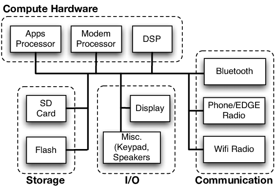

### Procesor (CPU)

Procesor, često nazvan "mozak" telefona, upravlja svim operacijama. Moderni pametni telefoni koriste procesore s više jezgri, što omogućava paralelno izvođenje više zadataka. Najpoznatiji proizvođači procesora su Qualcomm (Snapdragon), Apple (A-series), i Samsung (Exynos). Uloga procesora je ključna jer upravlja svim aplikacijama, kamerom, baterijom i svakodnevnim operacijama korisnika.

### Grafički procesor (GPU)

Grafički procesor je specijaliziran za prikaz slika, animacija i grafike. On je odgovoran za ugodno korisničko iskustvo prilikom igranja igara ili gledanja video sadržaja visoke rezolucije. U modernim telefonima, GPU je integriran s CPU-om u obliku sustava na čipu (SoC - System on Chip), što omogućuje efikasniji rad.

](./soc.png)

SOC. Izvor: [https://technolobe.com/2020/03/28/everything-about-smartphone-processors-or-socs](https://technolobe.com/2020/03/28/everything-about-smartphone-processors-or-socs/)

### Memorija (RAM i interna memorija)

RAM (Random Access Memory) služi kao radna memorija telefona, omogućujući brzi pristup podacima i aplikacijama. Veća količina RAM-a omogućava bolji multitasking i brži rad uređaja. Interna memorija služi za pohranu podataka kao što su aplikacije, fotografije i operacijski sustav. Noviji telefoni često dolaze s minimalno 128 GB interne memorije, dok premium modeli nude i do 1 TB prostora.

### Ekran

Jedna od najprepoznatljivijih komponenti pametnog telefona je njegov ekran. Postoji nekoliko vrsta ekrana, a najčešće korišteni su:

- LCD (Liquid Crystal Display) – koristi pozadinsko osvjetljenje i pogodan je za jeftinije uređaje.
- OLED (Organic Light Emitting Diode) – omogućuje dublje crne boje i bolji kontrast, te troši manje energije.
- AMOLED (Active Matrix OLED) – još naprednija verzija OLED tehnologije, koja nudi visoku rezoluciju i brži odziv na dodir.

### Baterija

Baterija omogućuje napajanje svih komponenti i obično koristi litij-ionsku ili litij-polimersku tehnologiju. Kapacitet baterije mjeri se u miliampersatima (mAh), a ovisi o modelu telefona i njegovim potrebama za energijom. Tehnologije poput brzog punjenja (Fast Charging) i bežičnog punjenja postale su standard kod mnogih modernih pametnih telefona.

### Kamere

Kamere su danas ključna komponenta pametnog telefona. Većina telefona ima više leća (glavna kamera, ultraširoka kamera, telefoto kamera) kako bi se omogućile različite vrste fotografija. Napredni senzori i softverske značajke, poput HDR-a, omogućuju snimanje fotografija visoke kvalitete, čak i u zahtjevnim uvjetima osvjetljenja.

### Operacijski sustav

Operacijski sustavi, poput Android i iOS, upravljaju svim funkcijama telefona i omogućuju korisniku pristup aplikacijama i uslugama. Operacijski sustav komunicira s hardverom telefona, osiguravajući nesmetan rad. Također, redovite nadogradnje sustava donose nove funkcije, poboljšanja sigurnosti i optimizacije.

### Senzori

Pametni telefoni koriste različite senzore kako bi poboljšali korisničko iskustvo. Najčešći senzori uključuju:

- Akcelerometar – detektira pokrete i nagibe telefona.
- Žiroskop – omogućuje preciznije praćenje rotacije.
- Senzor blizine – detektira kada je telefon blizu lica kako bi ugasio ekran tijekom poziva.
- Senzor otiska prsta ili lica – za biometrijsku sigurnost.

Arhitektura pametnog telefona. Izvor: https://www.researchgate.net/figure/High-level-diagram-of-our-target-mobile-architecture-the-Android-G1-smartphone_fig1_221596410