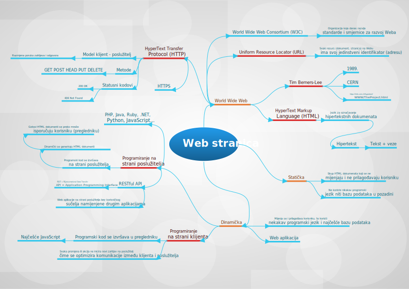

World Wide Web je jedna od dostupnih usluga na Internetu, a predstavlja sustav višestruko povezanih hipertekstnih dokumenata kojima se pristupa pomoću Web preglednika. Organizirana je kao sustav Web stranica (aplikacija) koje su dostupne preko jedinstvene adrese. Web stranice se smještaju na Web mjesta koja imaju svoje nazive (domene). Osnovne elemente i pojmove cijelog ovog sustava dajemo kao umnu mapu u nastavku.

U skladu sa spomenutim vrstama Web stranica i aplikacija možemo izdvojiti nekoliko pojmova odnosno često korištenih akronima:

- SPA = Single Page Application - predstavlja Web aplikaciju koja se bazira na programiranju na strani klijenta, odnosno radi se od dinamičkoj Web aplikaciji koja je formalno smještena unutar jednog HTML dokumenta koji se inicijalno preuzme s poslužitelja zajedno s programskim kodom i dalje se kompletno izvršava unutar preglednika korisnika. U pozadini takva aplikaciju koristi najčešće razne RESTful APIje za dohvat dinamičkih podataka.
- MPA = Multi-Page Application - predstavlja klasičnu Web aplikaciju koja se renderira na strani poslužitelja za svaki novi zahtjev korisnika ili promjenu. Dakle radi se o programiranju na strani poslužitelja. Ovakva aplikaciju može u manjoj ili većoj mjeri uključivati i programiranje na strani klijenta za neke elemente na svakoj od poslužiteljski renderiranih stranica.
- SSR = Server-Side Rendering - podrazumijeva renderiranje HTML dokumenta na strani poslužitelja.
- CSR = Client-Side Rendering - podrazumijeva renderiranje HTML dokumenta na strani klijenta.
- SSG = Static Site Generation - podrazumijeva postupak stvaranja Web stranice kroz proces generiranja kao niza statičnih HTML dokumenata. Gotov rezultat se isporučuje i postavlja na poslužitelj i izvršava kao statična Web stranica. U osnovi to je dinamička Web stranica, odnosno koristi se programski jezik u njenoj izradi, ali jednom kad je generiran rezultat ona postaje statička. Kao takva, međutim, može sadržavati dijelove klijentskog programskog koda na pojedinim statičkim HTML dokumentima.